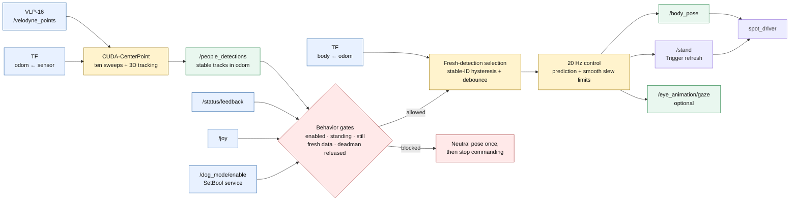
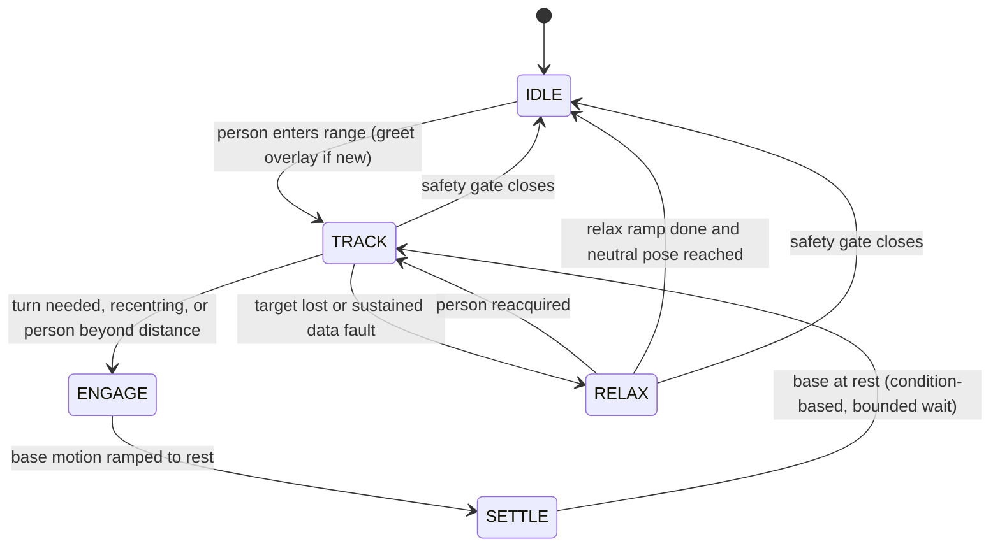

# Spot Dog Mode with CenterPoint

`spot_dog_mode` makes Spot greet and gaze-track nearby people, and can
optionally walk up to the tracked person and stop at a configured distance
(`approach_enabled`, off by default). The behavior consumes the stable tracks
published by the canonical CUDA-CenterPoint LiDAR pipeline:



CenterPoint accumulates ten motion-compensated LiDAR sweeps, detects 3D
pedestrian boxes, and tracks them in `odom` with stable IDs and filtered
velocities. On every fresh array, dog mode uses detection-stamped TF to
transform the tracks into Spot's `body` frame and re-evaluate the nearest
human. A 20 Hz controller then applies bounded velocity prediction and updates
both physical and optional animated-eye gaze from the same command state.

See [`../../docs/pedestrian_tracking.md`](../../docs/pedestrian_tracking.md)
for detector setup, engine generation, interfaces, and tuning.

## Requirements

Before starting dog mode:

- Run on the Jetson Orin container with CUDA and TensorRT available.
- Generate the CenterPoint TensorRT engine at least once.
- Publish `sensor_msgs/msg/PointCloud2` on `/velodyne_points`.
- Provide TF from the point-cloud frame to `odom`, and from `odom` to `body`.
- Run the Spot driver and teleop/status publishers for live robot operation.

The gaze controller intentionally stops commanding when Spot is not standing,
Spot is moving, the manual deadman is held, dog mode is disabled, detections
become stale, or the required TF is unavailable.

## Recommended live demo

The `auto_dog_mode` tmux session launches the Spot driver, Velodyne,
CenterPoint, dog mode, teleop, camera, and RViz exactly once:

```bash
cd /nav_ws/tmux/auto_dog_mode
tmuxinator local
```

The RViz pane loads `rviz2/auto_dog_mode.rviz`, centered on Spot's `body`
frame with the robot model, Velodyne cloud, CenterPoint track markers, TF/body
axes, and Kinect RGB view.

Do not separately launch `pedestrian_tracking.launch.py` when using this
session.

Enable or disable the behavior with the service:

```bash
ros2 service call /dog_mode/enable std_srvs/srv/SetBool "{data: true}"
ros2 service call /dog_mode/enable std_srvs/srv/SetBool "{data: false}"
```

The PS4 Circle-button integration may also toggle the behavior when the normal
teleop stack is running. The latched `/dog_mode/enabled` topic reports its
current state.

## Manual launch

If CenterPoint is already running elsewhere, start only the gaze controller:

```bash
ros2 launch spot_dog_mode dog_mode.launch.py
```

For a minimal composition, dog mode can include CenterPoint:

```bash
ros2 launch spot_dog_mode dog_mode.launch.py include_tracking:=true
```

`include_tracking:=true` starts only the detector/tracker in addition to the
gaze controller. It does not start the Velodyne driver, Spot driver, or an
odometry/TF source.

For a detector-only dry run without Spot powered on:

```bash
cd /nav_ws/tmux/auto_dog_mode_standalone
tmuxinator local
```

That session supplies a static `odom -> velodyne` transform for a stationary
test and opens the pedestrian-tracking RViz configuration. It does not run the
dog-mode controller or command Spot.

## Runtime behavior

The gaze controller:

1. Receives confirmed `PeopleArray` tracks on `/people_detections`.
2. Transforms positions, box tops, and velocities into `body` using the array
   timestamp. If that historical transform is unavailable, the configurable
   latest-TF fallback is used with a warning; loss of both transforms
   immediately neutralizes the controller.
3. Selects by planar distance. Height is intentionally excluded from proximity
   so a tall box is not treated as farther away than a short box at the same
   ground location. A person enters attention within `attention_radius` and
   stays the target out to the wider `attention_release_radius`, so walking
   away and back does not drop the track.
4. Keeps the current stable ID around noisy distance ties. A new target must
   remain at least `target_switch_margin` closer for
   `target_switch_debounce`, while a very large advantage switches
   immediately. Spatial matching tolerates short ID resets.
5. Recomputes yaw and head-height pitch on every TRACK tick. Greeting a new
   arrival is a time-varying pitch accent overlaid on tracking — it never
   freezes the target coordinates, blocks base motion, or replays around it.
6. Predicts a valid track velocity over a short, capped horizon to offset
   perception/control latency, then applies time-correct smoothing, a hard
   slew limit, and Spot-safe angle saturation.
7. Continues the predicted command through a brief occlusion. The eye message
   keeps the same command angles but reports `detected=false`; after the target
   loss timeout, both outputs return smoothly to neutral.
   A missing TF or a late detection array holds the current aim for
   `data_fault_grace` rather than neutralizing, because one dropped frame
   should not throw the body to centre and back. A fault that outlives the
   grace eases out through RELAX instead of snapping. Only operator and
   posture faults — disabled, deadman released, sitting, moving — neutralize
   immediately.
   A person reacquired within `greet_repeat_timeout` resumes TRACK rather than
   replaying the greeting, so a detector ID reset or a short occlusion no
   longer produces a visible bob.
8. Calls the driver's `stand` service alongside each pose so the robot actually
   adopts it. `spot_driver`'s `body_pose` subscriber only latches the pose into
   its mobility params; Spot applies those params when it builds its next stand
   command. Without the refresh the body holds whatever pose the previous stand
   captured, which looks like one glance rather than continuous tracking. The
   refresh is rate limited to `stand_refresh_rate` and is skipped whenever Spot
   is not standing still, so it never interrupts a walk, sit, or trajectory.
   Each accepted stand also renews the upright confirmation. The driver reports
   `standing: false` for as long as a stand is still settling, and the refresh
   keeps issuing new ones, so the raw flag can stay false for the whole time
   gaze is tracking a moving person. Gating on the flag alone drops the gaze to
   neutral roughly once per `standing_grace` and picks it straight back up. A
   rejected stand stops renewing the confirmation, so a robot that can no
   longer stand still closes the gate.



The repetitive fault arrows are omitted for readability; see
[`../../docs/gaze_controller_states.md`](../../docs/gaze_controller_states.md)
for the complete state description, including how `ENGAGE` blends rotation
and walking into one continuous command, stops translation on any stale or
missing detection, and hands the body back through `SETTLE`.

The default attention radius is 4 m. If CenterPoint reports a useful 3D box
height, dog mode aims toward the top of the box; otherwise it uses the
configured fallback person height.

## Person approach (opt-in)

With `approach_enabled: true`, Spot walks toward the tracked person from
`TRACK` and stops at `approach_distance` (default 1.0 m), measured as the
planar distance from the body-frame origin to the person's tracked position.
The feature is disabled by default because it commands autonomous translation.

The blended base controller (`base_motion.py`) limits forward speed to the
smaller of a proportional command and the braking-distance limit
`sqrt(2 * approach_accel_limit * error)`, ramps it under
`approach_accel_limit`, and scales it continuously with alignment: a raised
cosine gives full speed straight ahead, half speed at
`approach_alignment_yaw`, and zero beyond twice it. A bounded proportional
yaw correction keeps the person centred while walking, so an off-axis person
is approached as an arc that tightens as the bearing closes rather than
through a turn-stop-walk sequence. The walk restarts only when the person
moves beyond `approach_distance + approach_resume_margin`, which is what
prevents oscillation across the stopping threshold.

Approach shares the `cmd_vel_intermediate` velocity path (`turn_cmd_topic`)
and every safety gate with base turning: deadman release, disable, operator
stick input, loss of posture, and unexplained external motion all publish a
zero `Twist` immediately. Stand refreshes and body poses are suspended while
the base moves, so a stand can never cancel an active velocity command. Spot
never advances on predicted or stale data — one missing, late, or
untransformable detection zeroes forward velocity on that tick — and a small
2D base-motion history compensates each measured range for the ground covered
between the lidar sweep and the command, so detection latency does not cause
overshoot.

Behavior parameters are in `config/params.yaml`. Important settings include:

| Parameter | Default | Purpose |
|---|---:|---|
| `attention_radius` | `4.0` m | Distance at which a new person enters attention |
| `attention_release_radius` | `6.0` m | Distance the current person is followed out to |
| `command_rate` | `20.0` Hz | Timed body/eye control rate |
| `target_switch_margin` | `0.30` m | Sustained advantage required to change targets |
| `target_switch_debounce` | `0.20` s | Tie-noise rejection before a normal switch |
| `target_switch_immediate_margin` | `0.75` m | Advantage that bypasses debounce |
| `target_lost_timeout` | `1.0` s | Occlusion time before relaxing |
| `detection_timeout` | `0.75` s | Maximum receive gap or source-stamp age |
| `data_fault_grace` | `0.4` s | Aim held through a missing TF or late array |
| `greet_repeat_timeout` | `8.0` s | Return sooner than this and TRACK resumes |
| `prediction_horizon` / `max_prediction_horizon` | `0.15` / `0.35` s | Nominal and capped velocity look-ahead |
| `greet_ramp` / `greet_hold` | `0.35` / `0.65` s | Greeting-accent timing |
| `smoothing_tau` | `0.20` s | Time-correct command smoothing |
| `max_rate_rad_s` | `0.80` rad/s | Hard body-pose slew limit |
| `stand_refresh` | `true` | Re-issue `stand` so the streamed pose reaches Spot |
| `stand_service` | `stand` | Trigger service that restands with current mobility params |
| `stand_refresh_rate` | `10.0` Hz | Rate limit for those stand requests |
| `standing_grace` | `2.0` s | Tolerated `standing: false` while a stand settles |
| `deadman_button` | `4` | Manual-control override button |
| `approach_enabled` | `false` | Opt-in walking toward the tracked person |
| `approach_distance` | `1.0` m | Desired body-to-person planar stopping distance |
| `approach_resume_margin` | `0.25` m | Walk restarts only beyond distance + margin |
| `approach_max_speed` | `0.40` m/s | Forward speed ceiling while approaching |
| `approach_speed_gain` | `0.50` (m/s)/m | Proportional speed per metre of range error |
| `approach_accel_limit` | `0.50` m/s² | Acceleration, deceleration, and braking-distance limit |
| `approach_alignment_yaw` | `0.30` rad | Bearing of half forward speed; zero beyond twice it |
| `recenter_yaw` | `0.25` rad | Sustained gaze offset that squares the base up (0 disables) |
| `recenter_debounce` | `1.5` s | Offset must persist this long before recentring |

Detector and tracker parameters are configured separately in
`people_detector/config/centerpoint_people.yaml`.

Only human tracks with finite positions are considered. Non-finite or
implausibly fast velocity disables prediction for that track. Missing,
non-finite, too-short, or too-tall box heights use the configured standing
head-height fallback. People beside or behind Spot remain valid nearest
targets, but their physical yaw is saturated at `max_yaw`; the animated eyes
use that same saturated command. Disable, sitting, robot motion, manual
deadman, stale input, and TF failure send one neutral body/eye command and
clear the selected target.

When `publish_eye_gaze` is enabled, this controller should be the only
publisher to `eye_animation/gaze`. Eye output is normalized from the actual
bounded body command, reports `detected=false` during occlusion and RELAX, and
returns to `(0, 0)` on every safety shutdown.

## Verification

From the repository root, enter the project container before running ROS
commands:

```bash
./container shell
```

Then verify input and output rates:

```bash
ros2 topic hz /velodyne_points
ros2 topic hz /people_detections
ros2 topic hz /body_pose
ros2 topic hz /eye_animation/gaze  # only when publish_eye_gaze=true
ros2 topic echo /centerpoint_people/diagnostics --once
ros2 topic echo /dog_mode/enabled --once
ros2 topic echo /status/feedback --once
```

RViz should display stable-ID boxes, velocity arrows, and labels from
`/people_detections_markers`.

With the behavior allowed and a target present, `/body_pose` and optional eye
gaze should be approximately 20 Hz. The first command should follow a fresh
detection within 100 ms under normal load; normal target switches should
complete within 300 ms after the distance advantage crosses 0.30 m, and
switches above 0.75 m should complete within one control period. Over a
60-second stationary run, target-ID churn at a noisy tie should be zero unless
the margin persists, control-period p95 should be at most 60 ms, and no
single period should exceed 100 ms. Consecutive command deltas must remain at
or below `max_rate_rad_s * elapsed_time`.

Exercise these live scenarios before enabling unattended operation:

- two people crossing and lingering near equal distance;
- one person approaching rapidly, plus lateral and vertical motion;
- a short occlusion followed by an occlusion longer than 1.0 s;
- missing TF, stale detections, malformed height/velocity, and unstable IDs;
- disable-mid-track, manual deadman, sitting, and robot-motion gates;
- people directly beside and behind Spot to confirm safe saturation.

For rosbag validation, record the topics listed in
[`../../docs/bag_collection.md`](../../docs/bag_collection.md), including
`/people_detections`, `/tf`, `/tf_static`, `/status/feedback`, `/joy`,
`/body_pose`, optional `/eye_animation/gaze`, `/dog_mode/enabled`, and
`/rosout`. Replay with `--clock` and launch dog mode with
`use_sim_time:=true`; run perception first when the bag contains raw points
rather than `PeopleArray`, and provide synthetic standing feedback only for
an explicitly non-hardware dry run. Compare each output timestamp and angle
against the selected nearest track; body and eye commands must identify the
same target state on every sample.

If CenterPoint publishes tracks but Spot does not react, check:

- Dog mode is enabled.
- `/status/feedback` reports `sitting: false` and `moving: false`. `standing`
  blinks off while a stand refresh settles, so the gate tolerates it for
  `standing_grace` rather than treating it as a sit.
- The manual deadman (L1) is held.
- TF can transform `odom` into `body`.
- `/people_detections` is fresh and contains a person within the attention
  radius.

If `/body_pose` streams at 20 Hz but the body only moves once and then holds,
the stand refresh is not reaching the driver. Confirm `stand_refresh` is true
and that `stand_service` resolves to the driver's service, which is namespaced
when `spot_name` is set:

```bash
ros2 service list | grep stand
```
